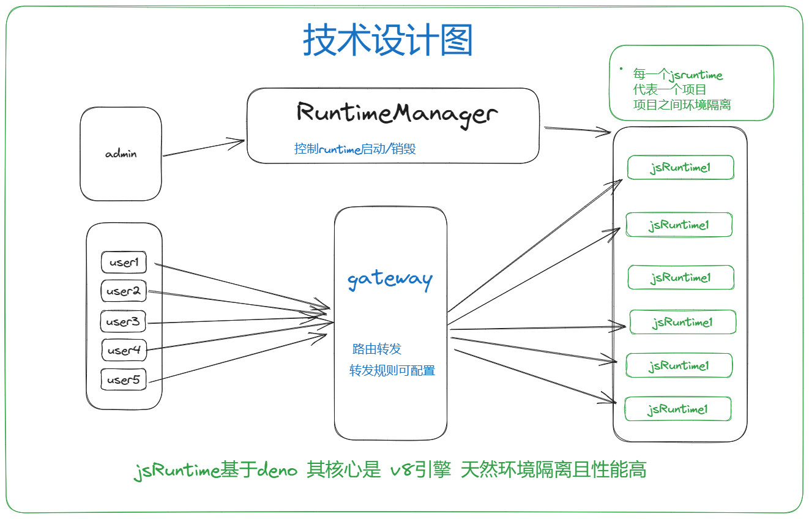
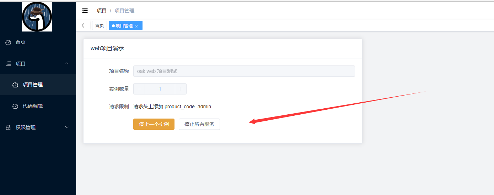
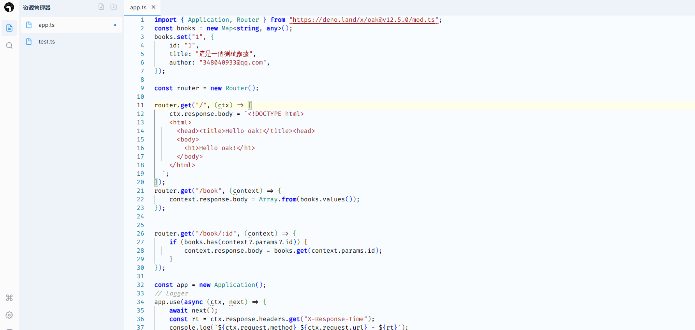

# Deno Cool

## 介紹

这是一个很cool 的项目, 基于deno 的 js运行时,serverless 项目 可以再rust 端提供很多的 
公共服务以op 的方式提供给deno 运行时 deno ts脚本可以专注更多的业务部分。 项目启动毫秒级
类deno deploy，可在线控制启动关闭deno，在线代码编辑，支持产品化租户化

启动毫秒级，完全兼容deno生态，多项目启动环境隔离

## 技术栈

rust ,deno ,javascript,typescript

## 技术思路



## 技术难点

1. 兼容deno 原生态，deno 运行机制

2. web项目启动时会重复监听端口如何解决

3. v8只能在单单线程里运行，线程之间如何通信

4. gateway网关实现

5. 租户化 runtime

## rust用到的库

```yaml
//核心的几个
v8 #核心
deno_core #deno 核心依赖v8
deno_ast  #deno 代码解析
deno_ops  #deno ops实现
serde_v8  #json 数据序列化
deno_runtime  #deno 高阶封装基于deno_core 
deno_npm  #对于nodejs npm 库的兼容
。。。
```
## 目录结构
```
deno-cool
├── Cargo.toml //workerspace项目依赖
├── cassie-cool //admin web管理端项目
├── code //代码存放目录
│   ├── admin  //目录名称为项目名称
├── code_editor //代码编辑器
├── context //核心包
├── demo    //案例代码目录
│   ├── app.ts
│   ├── data.json
│   ├── demo.html
│   ├── deno.json
│   └── deno.lock
├── ext     //deno扩展包
├── frontend //管理端前端代码
├── lib    //v8编译文件 
│   ├── rusty_v8.lib
│   └── rusty_v8.sum
├── runtime //deno runtime
├── service  //deno runtime二次封装核心包
```
## cassie-cool说明
    这是一个deno 运行时的管理端web 项目
    承载了项目和运行时的管理 还兼任了 多项目之间的路由转发
    是一个简易版的 gateway
```rust
///主入口
#[tokio::main]
async fn main() -> std::io::Result<()> {
  env_logger::init_from_env(env_logger::Env::new().default_filter_or("info"));
  //WorkerTable 是jsRuntime容器
  let worker_table = web::Data::new(Mutex::new(WorkerTable::new())); 
    //PortTable是 WorkerTable 和WorkerPort 的映射关系
  let handle_port = web::Data::new(RwLock::new(PortTable::new()));
    //WorkerPort 是容器web项目端口起始值
  let worker_port = web::Data::new(Mutex::new(WorkerPort(3000)));
  let file_table: web::Data<Mutex<HashMap<String, String>>> = web::Data::new(Mutex::new(HashMap::new()));
  log::info!("starting main HTTP server at http://127.0.0.1:9999");
  HttpServer::new(move || {
    //在这里写  是有问题的  只会在当前线程里有效

    App::new()
      .configure(api_routers)
      .app_data(worker_table.clone())
      .app_data(handle_port.clone())
      .app_data(worker_port.clone())
      .app_data(file_table.clone())
      .app_data(web::Data::new(Client::default()))
      .wrap(middleware::Logger::default())
        //路由转发
      .default_service(web::to(forward))
  })
  .bind(("127.0.0.1", 9999))?
  .run()
  .await
}
```
 前端项目请求说明 如果是请求对应的 deno运行时 api,
 deno api 设计的时候 不能和 cassie-cool  api 冲突
 并且 api header 需要加 product_code= 项目英文名称
 这样就会请求到对应的api了
## 项目构建及启动
### `构建代码`
    1：rust 版本建议使用最新版  更新命令:rustup update
    2：根目录执行 cargo build
    3：v8相关错误的时候把  /lib 文件下的东西拷贝到 /target/debug/gn_out/obj/ 目录
    重新执行 cargo build
### 启动项目
    1：优先启动项目 cassie-cool 
    2：启动ui frontend 管理端
    3：启动code_editor 代码编辑器


### 项目截图
管理端（启动项目实例）

在线代码编辑器

## 作者Cassie<348040933@qq.com>